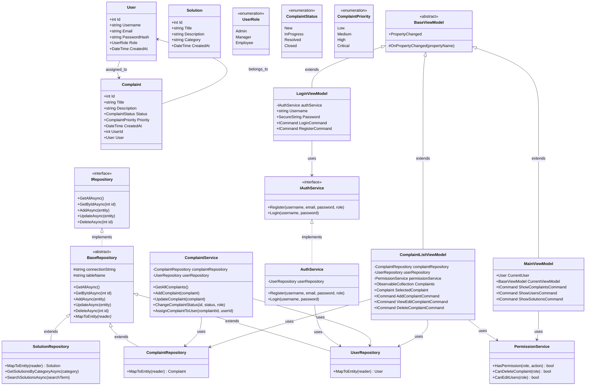

# System Obsługi Reklamacji

Aplikacja WPF do zarządzania reklamacjami obsługiwana przez pracowników z systemem uprawnień opartym na rolach.

## 📋 Spis treści

- [Opis projektu](#opis-projektu)
- [Funkcjonalności](#funkcjonalności)
- [Stack technologiczny](#stack-technologiczny)
- [Wymagania systemowe](#wymagania-systemowe)
- [Instalacja](#instalacja)
- [Konfiguracja](#konfiguracja)
- [Struktura projektu](#struktura-projektu)
- [Paradygmat obiektowy](#paradygmat-obiektowy)
- [Diagram UML](#diagram-uml)
- [Użytkowanie](#użytkowanie)
- [Licencja](#licencja)

## 🎯 Opis projektu

System Obsługi Reklamacji to aplikacja desktopowa stworzona w technologii WPF (.NET 8.0) przeznaczona do zarządzania procesem obsługi reklamacji w przedsiębiorstwie. Aplikacja umożliwia pracownikom różnych szczebli efektywne zarządzanie zgłoszeniami, ich statusami oraz dostępem do bazy rozwiązań.

## ✨ Funkcjonalności

### Główne funkcje:
- **Zarządzanie reklamacjami**: Tworzenie, wyświetlanie, edycja i usuwanie reklamacji
- **System statusów**: Śledzenie cyklu życia reklamacji (New → InProgress → Resolved → Closed)
- **Przypisywanie użytkownikom**: Delegowanie odpowiedzialności za konkretne reklamacje
- **System uprawnień**: Rozróżnienie ról (Admin, Manager, Employee) z różnymi poziomami dostępu
- **Repozytorium rozwiązań**: Baza wiedzy do automatyzacji i wspomagania pracy pracowników

### Dodatkowe funkcjonalności:
- Bezpieczne uwierzytelnianie z hashowaniem haseł (BCrypt)
- Intuicyjny interfejs użytkownika z Material Design
- Filtrowanie i wyszukiwanie reklamacji
- Powiadomienia o zmianach statusów

## 📸 Zrzuty Ekranu Aplikacji:


## 🛠 Stack technologiczny

- **Framework**: .NET 8.0
- **UI**: WPF (Windows Presentation Foundation)
- **Baza danych**: MySQL
- **ORM**: Custom Repository Pattern
- **Haszowanie haseł**: BCrypt.Net
- **Design**: Material Design In XAML
- **Architektura**: MVVM (Model-View-ViewModel)

## 📋 Wymagania systemowe

- Windows 10/11 (x64)
- .NET 8.0 Runtime
- MySQL Server 8.0+
- Minimum 4GB RAM
- 100MB wolnego miejsca na dysku

## 🔧 Instalacja

1. **Pobierz kod źródłowy**:
   ```bash
   https://github.com/KAFLA/Complaint-System.git
   cd Complaint-System
   ```

2. **Przywróć pakiety NuGet**:
   ```bash
   dotnet restore
   ```

3. **Skonfiguruj bazę danych**:
   - Uruchom MySQL Server
   - Wykonaj skrypt `Example_database.sql` w MySQL


## ⚙️ Konfiguracja

### Konfiguracja bazy danych

Aplikacja wymaga pliku `App.config` w katalogu głównym z konfiguracją połączenia do bazy danych. 

**Plik konfiguracyjny jest tworzony przez osobny program `AppConfig.exe`. Program gotowy do kompliacji dołączony jest również do projektu. Po skompilowaniu aplikacji należy przrzucić ją do folderu z plikiem wykonywalnym aplikacji głównej `SystemReklamacji.exe` lub przenieść tam wygenerowany plik `App.config`**


### Domyślne konta użytkowników

Po pierwszym uruchomieniu możesz zarejestrować nowe konta lub skorzystać z domyślnych:
- **Admin**: Pełne uprawnienia do zarządzania systemem
- **Manager**: Zarządzanie użytkownikami i reklamacjami
- **Employee**: Tworzenie i edycja własnych reklamacji

## 📁 Struktura projektu

```
ReklamacjeSystem/
├── Models/                    # Modele danych
│   ├── User.cs               # Model użytkownika
│   ├── Complaint.cs          # Model reklamacji
│   ├── Solution.cs           # Model rozwiązania
│   └── IRepository.cs        # Interfejs repozytorium
├── ViewModels/               # ViewModele (MVVM)
│   ├── BaseViewModel.cs      # Bazowy ViewModel
│   ├── LoginViewModel.cs     # ViewModel logowania
│   ├── MainViewModel.cs      # Główny ViewModel
│   ├── ComplaintListViewModel.cs
│   └── ComplaintEditViewModel.cs
├── Views/                    # Widoki WPF
│   ├── LoginWindow.xaml      # Okno logowania
│   ├── MainWindow.xaml       # Główne okno
│   ├── ComplaintListView.xaml
│   └── ComplaintEditWindow.xaml
├── Repositories/             # Warstwa dostępu do danych
│   ├── BaseRepository.cs     # Bazowe repozytorium
│   ├── UserRepository.cs     # Repozytorium użytkowników
│   ├── ComplaintRepository.cs
│   └── SolutionRepository.cs
├── Services/                 # Usługi biznesowe
│   ├── AuthService.cs        # Uwierzytelnianie
│   ├── PermissionService.cs  # Zarządzanie uprawnieniami
│   └── NotificationService.cs
└── App.xaml                  # Konfiguracja aplikacji
```

## 🏗 Paradygmat obiektowy

Aplikacja została zaprojektowana z zachowaniem kluczowych zasad programowania obiektowego:

### 🔒 Enkapsulacja
- **Modele danych**: Właściwości z kontrolowanym dostępem (get/set)
- **Repozytoria**: Ukrywanie szczegółów implementacji dostępu do bazy danych
- **Usługi**: Enkapsulacja logiki biznesowej w dedykowanych klasach

```csharp
public class User
{
    public int Id { get; set; }
    public string Username { get; set; }
    private string _passwordHash; // Enkapsulowane hasło
}
```

### 🧬 Dziedziczenie
- **BaseRepository<T>**: Wspólna funkcjonalność dla wszystkich repozytoriów
- **BaseViewModel**: Implementacja INotifyPropertyChanged dla wszystkich ViewModeli
- **Hierarchia uprawnień**: UserRole enum z różnymi poziomami dostępu

```csharp
public abstract class BaseRepository<T> : IRepository<T> where T : class, new()
{
    protected abstract T MapToEntity(MySqlDataReader reader);
}

public class UserRepository : BaseRepository<User>
{
    protected override User MapToEntity(MySqlDataReader reader) { /* */ }
}
```

### 🔄 Polimorfizm
- **IRepository<T>**: Wspólny interfejs dla różnych typów repozytoriów
- **IAuthService**: Interfejs usługi uwierzytelniania
- **RelayCommand**: Uniwersalna implementacja ICommand

```csharp
public interface IRepository<T> where T : class
{
    Task<IEnumerable<T>> GetAllAsync();
    Task<T> GetByIdAsync(int id);
}
```

### 🎭 Abstrakcja
- **Separation of Concerns**: Wyraźny podział na warstwy (Models, Views, ViewModels, Services)
- **MVVM Pattern**: Separacja logiki prezentacji od logiki biznesowej
- **Repository Pattern**: Abstrakcja dostępu do danych

### 🔧 Zasady SOLID
- **Single Responsibility**: Każda klasa ma jedną odpowiedzialność
- **Open/Closed**: Łatwe rozszerzanie funkcjonalności przez dziedziczenie
- **Liskov Substitution**: Klasy pochodne są kompatybilne z klasami bazowymi
- **Interface Segregation**: Małe, wyspecjalizowane interfejsy
- **Dependency Inversion**: Zależności od abstrakcji, nie od konkretnych implementacji

## 📊 Diagram UML

<!-- Tutaj zostanie umieszczony diagram UML systemu -->


## 🚀 Użytkowanie

### Pierwsze uruchomienie
1. Uruchom `AppConfig.exe` aby skonfigurować połączenie z bazą danych
2. Uruchom aplikację główną `ReklamacjeSystem.exe`
3. Zarejestruj pierwsze konto administratora
4. Zaloguj się i rozpocznij korzystanie z systemu

### Podstawowe operacje
- **Dodawanie reklamacji**: Przycisk "Add Complaint" w głównym oknie
- **Edycja reklamacji**: Kliknij "View/Edit" przy wybranej reklamacji
- **Zmiana statusu**: Przycisk "Change Status" lub edycja reklamacji
- **Zarządzanie użytkownikami**: Dostępne dla ról Manager i Admin

### Role użytkowników
- **Employee**: Może tworzyć i edytować własne reklamacje, przeglądać rozwiązania
- **Manager**: Dodatkowo może zarządzać użytkownikami i wszystkimi reklamacjami
- **Admin**: Pełne uprawnienia do wszystkich funkcji systemu

## 📄 Licencja

Ten projekt jest licencjonowany na zasadach MIT License. Zobacz plik `LICENSE` dla szczegółów.

---

**Wersja**: 0.19.1 
**Ostatnia aktualizacja**: 2025-06-28  
**Autorzy**: [Mateusz Kazuła], [Dawid Kubica]  
