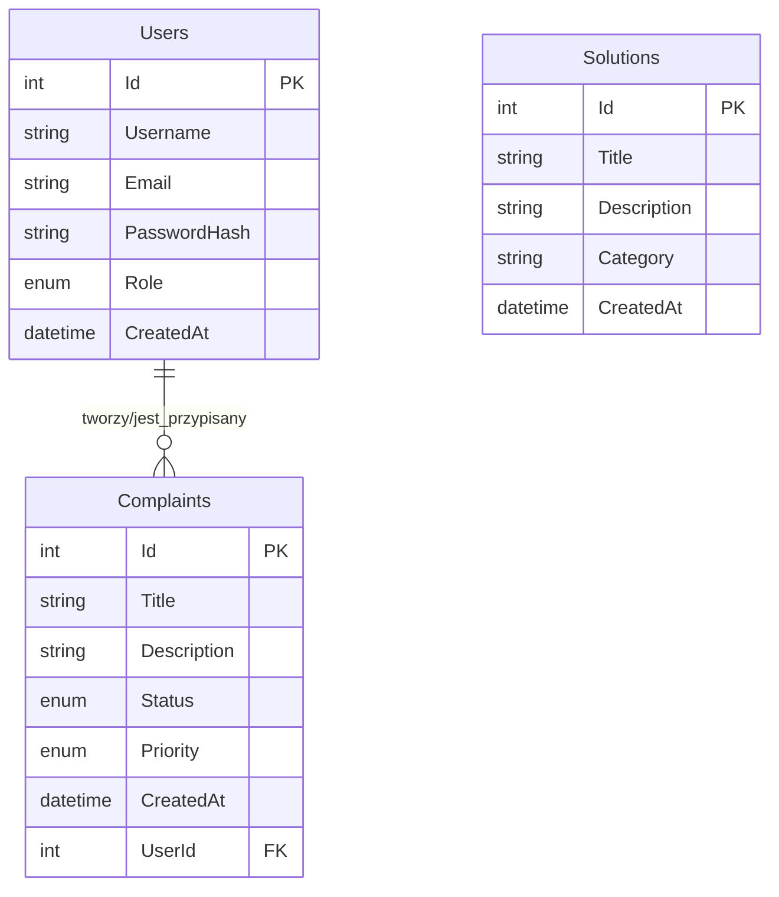

# 🎯 System Obsługi Reklamacji

<div align="center">


**Profesjonalny system do zarządzania reklamacjami klientów z zaawansowanym systemem uprawnień**

[📋 Funkcjonalności](#funkcjonalności) • [🚀 Instalacja](#instalacja) • [🏗️ Architektura](#architektura) • [📸 Zrzuty ekranu](#zrzuty-ekranu)

</div>

---

## 📋 Funkcjonalności

### 🔐 System Użytkowników
- **Trzy poziomy uprawnień**: Admin, Manager, Employee
- **Bezpieczne hashowanie haseł** z wykorzystaniem BCrypt
- **Logowanie i rejestracja** z walidacją danych

### 📋 Zarządzanie Reklamacjami
- ✅ Tworzenie nowych reklamacji
- 📝 Edycja i podgląd szczegółów
- 🔄 System statusów: `Nowa` → `W toku` → `Rozwiązana` → `Zamknięta`
- 🎯 Przypisywanie reklamacji do pracowników
- 🏷️ Priorytety: Niski, Średni, Wysoki, Krytyczny

### 💡 Repozytorium Rozwiązań
- 📚 Baza wiedzy z rozwiązaniami problemów
- 🔍 Wyszukiwanie po kategorii i słowach kluczowych
- ➕ Dodawanie i edycja rozwiązań

### 🛡️ System Uprawnień
| Rola | Reklamacje | Użytkownicy | Rozwiązania |
|------|------------|-------------|-------------|
| **Admin** | Pełne uprawnienia | Pełne uprawnienia | Pełne uprawnienia |
| **Manager** | Zarządzanie wszystkimi | Tylko edycja ról | Pełne uprawnienia |
| **Employee** | Własne + przypisane | Brak dostępu | Tylko podgląd |

---

## 🚀 Instalacja

### 📋 Wymagania
- **Windows 10/11**
- **.NET 8.0 Runtime**
- **MySQL Server 8.0+**
- **Visual Studio 2022** (dla deweloperów)

### ⚡ Szybka instalacja

1. **Sklonuj repozytorium**
```bash
git clone https://github.com/twoja-nazwa/reklamacje-system.git
cd reklamacje-system
```

2. **Skonfiguruj bazę danych**
```sql
-- Utwórz bazę danych
CREATE DATABASE reklamacje_db CHARACTER SET utf8mb4 COLLATE utf8mb4_unicode_ci;

-- Utwórz użytkownika (opcjonalnie)
CREATE USER 'reklamacje_user'@'localhost' IDENTIFIED BY 'zaq1@WSX';
GRANT ALL PRIVILEGES ON reklamacje_db.* TO 'reklamacje_user'@'localhost';
FLUSH PRIVILEGES;
```

3. **Wykonaj skrypt bazy danych**
```sql
-- Uruchom dostarczony skrypt SQL do utworzenia tabel
-- (znajdziesz go w folderze Database/)
```

4. **Zaktualizuj connection string**
```csharp
// W plikach LoginWindow.xaml.cs i MainWindow.xaml.cs
string connectionString = "server=localhost;port=3306;database=reklamacje_db;user=twoj_uzytkownik;password=twoje_haslo;SslMode=None;";
```

5. **Uruchom aplikację**
```bash
dotnet run
```

---

## 🏗️ Architektura

### 📁 Struktura Projektu
```
ReklamacjeSystem/
├── 📂 Models/              # Modele danych (User, Complaint, Solution)
├── 📂 Repositories/        # Warstwa dostępu do danych (Repository Pattern)
├── 📂 Services/           # Logika biznesowa (AuthService, PermissionService)
├── 📂 ViewModels/         # MVVM - ViewModele z logiką prezentacji
├── 📂 Views/              # Interfejs użytkownika (WPF)
└── 📂 Database/           # Skrypty SQL
```

### 🎯 Zastosowane Wzorce Projektowe

**🏛️ Repository Pattern**
- Abstrakcja dostępu do danych
- Generyczna klasa bazowa `BaseRepository<T>`
- Implementacje dla każdej encji

**🎭 MVVM (Model-View-ViewModel)**
- Separacja logiki biznesowej od UI
- Data binding z WPF
- Command pattern dla akcji użytkownika

**🔌 Dependency Injection**
- Luźne powiązanie między komponentami
- Łatwiejsze testowanie
- Elastyczna konfiguracja

**🎪 Strategy Pattern**
- System uprawnień `PermissionService`
- Różne strategie dla różnych ról

### 🗄️ Model Bazy Danych



### 🔧 Technologie

| Komponent | Technologia | Opis |
|-----------|------------|------|
| **Backend** | .NET 8.0 | Główna platforma aplikacji |
| **UI** | WPF + Material Design | Nowoczesny interfejs użytkownika |
| **Database** | MySQL 8.0 | Relacyjna baza danych |
| **ORM** | ADO.NET | Bezpośredni dostęp do bazy |
| **Security** | BCrypt.NET | Hashowanie haseł |
| **Pattern** | MVVM | Architektura prezentacji |

---

## 📸 Zrzuty Ekranu

### 🔐 Ekran Logowania
*Elegancki interfejs z opcją rejestracji nowych użytkowników*

### 📋 Lista Reklamacji
*Przejrzysty widok z filtrowaniem i kolorowym oznaczaniem statusów*

### ✏️ Edytor Reklamacji
*Tryb podglądu/edycji z dynamicznymi uprawnieniami*

### 💡 Repozytorium Rozwiązań
*Baza wiedzy z możliwością wyszukiwania*

---

## 🎯 Kluczowe Cechy Implementacji

### 🔒 Bezpieczeństwo
- **Hashowanie haseł** - BCrypt z salt
- **Kontrola uprawnień** - na poziomie UI i logiki
- **Walidacja danych** - po stronie klienta i serwera

### 🚀 Wydajność
- **Asynchroniczne operacje** - wszystkie zapytania do bazy
- **Lazy loading** - ładowanie danych na żądanie
- **Connection pooling** - optymalizacja połączeń MySQL

### 🎨 UX/UI
- **Material Design** - nowoczesny wygląd
- **Responsywny design** - dopasowanie do różnych rozdzielczości
- **Intuicyjna nawigacja** - logiczny przepływ użytkownika
- **Real-time updates** - odświeżanie list po zmianach

### 📦 Rozszerzalność
- **Plugin architecture** - łatwe dodawanie nowych funkcji
- **Configurable permissions** - elastyczny system ról
- **Database migrations** - zarządzanie zmianami schematu

---

## 🚧 Roadmapa

### v2.0 - Q2 2025
- [ ] 📊 Dashboard z wykresami i statystykami
- [ ] 📧 System powiadomień email
- [ ] 📱 Aplikacja mobilna (MAUI)
- [ ] 🔍 Zaawansowane filtry i raporty

### v3.0 - Q3 2025
- [ ] 🤖 AI dla automatycznej kategoryzacji
- [ ] 🌐 API REST dla integracji
- [ ] 📈 Analityka i metryki wydajności
- [ ] 🏢 Multi-tenant support

---

## 👥 Dla Deweloperów

### 🛠️ Środowisko deweloperskie
```bash
# Klonowanie i konfiguracja
git clone https://github.com/twoja-nazwa/reklamacje-system.git
cd reklamacje-system

# Restore packages
dotnet restore

# Build solution
dotnet build

# Run tests
dotnet test
```

### Diagram klas UML
```markdown
classDiagram
    %% Modele danych
    class User {
        +int Id
        +string Username
        +string Email
        +string PasswordHash
        +UserRole Role
        +DateTime CreatedAt
    }

    class Complaint {
        +int Id
        +string Title
        +string Description
        +ComplaintStatus Status
        +ComplaintPriority Priority
        +DateTime CreatedAt
        +int UserId
        +User User
    }

    class Solution {
        +int Id
        +string Title
        +string Description
        +string Category
        +DateTime CreatedAt
    }

    %% Enumy
    class UserRole {
        <<enumeration>>
        Admin
        Manager
        Employee
    }

    class ComplaintStatus {
        <<enumeration>>
        New
        InProgress
        Resolved
        Closed
    }

    class ComplaintPriority {
        <<enumeration>>
        Low
        Medium
        High
        Critical
    }

    %% Interfejs Repository
    class IRepository {
        <<interface>>
        +GetAllAsync()
        +GetByIdAsync(int id)
        +AddAsync(entity)
        +UpdateAsync(entity)
        +DeleteAsync(int id)
    }

    %% Klasa bazowa Repository
    class BaseRepository {
        <<abstract>>
        #string connectionString
        #string tableName
        +GetAllAsync()
        +GetByIdAsync(int id)
        +AddAsync(entity)
        +UpdateAsync(entity)
        +DeleteAsync(int id)
        +MapToEntity(reader)*
    }

    %% Konkretne repozytoria
    class UserRepository {
        +MapToEntity(reader) User
    }

    class ComplaintRepository {
        +MapToEntity(reader) Complaint
    }

    class SolutionRepository {
        +MapToEntity(reader) Solution
        +GetSolutionsByCategoryAsync(category)
        +SearchSolutionsAsync(searchTerm)
    }

    %% Serwisy
    class IAuthService {
        <<interface>>
        +Register(username, email, password, role)
        +Login(username, password)
    }

    class AuthService {
        -UserRepository userRepository
        +Register(username, email, password, role)
        +Login(username, password)
    }

    class ComplaintService {
        -ComplaintRepository complaintRepository
        -UserRepository userRepository
        +GetAllComplaints()
        +AddComplaint(complaint)
        +UpdateComplaint(complaint)
        +ChangeComplaintStatus(id, status, role)
        +AssignComplaintToUser(complaintId, userId)
    }

    class PermissionService {
        +HasPermission(role, action) bool
        +CanDeleteComplaint(role) bool
        +CanEditUsers(role) bool
    }

    %% ViewModels
    class BaseViewModel {
        <<abstract>>
        +PropertyChanged
        #OnPropertyChanged(propertyName)
    }

    class LoginViewModel {
        -IAuthService authService
        +string Username
        +SecureString Password
        +ICommand LoginCommand
        +ICommand RegisterCommand
    }

    class MainViewModel {
        +User CurrentUser
        +BaseViewModel CurrentViewModel
        +ICommand ShowComplaintsCommand
        +ICommand ShowUsersCommand
        +ICommand ShowSolutionsCommand
    }

    class ComplaintListViewModel {
        -ComplaintRepository complaintRepository
        -UserRepository userRepository
        -PermissionService permissionService
        +ObservableCollection Complaints
        +Complaint SelectedComplaint
        +ICommand AddComplaintCommand
        +ICommand ViewEditComplaintCommand
        +ICommand DeleteComplaintCommand
    }

    %% Relacje dziedziczenia
    IRepository <|.. BaseRepository : implements
    BaseRepository <|-- UserRepository : extends
    BaseRepository <|-- ComplaintRepository : extends
    BaseRepository <|-- SolutionRepository : extends
    IAuthService <|.. AuthService : implements

    BaseViewModel <|-- LoginViewModel : extends
    BaseViewModel <|-- MainViewModel : extends
    BaseViewModel <|-- ComplaintListViewModel : extends

    %% Relacje zależności
    AuthService --> UserRepository : uses
    ComplaintService --> ComplaintRepository : uses
    ComplaintService --> UserRepository : uses
    LoginViewModel --> IAuthService : uses
    ComplaintListViewModel --> ComplaintRepository : uses
    ComplaintListViewModel --> UserRepository : uses
    ComplaintListViewModel --> PermissionService : uses
    MainViewModel --> PermissionService : uses

    %% Asocjacje między modelami
    User --> Complaint : assigned_to
    Complaint --> User : belongs_to
```
### 🧪 Testowanie
- **Unit tests** - xUnit framework
- **Integration tests** - testowanie z bazą danych
- **UI tests** - White framework dla WPF

### 📝 Konwencje kodu
- **Clean Code** - czytelny i samozadokumentujący kod
- **SOLID principles** - zasady projektowania obiektowego
- **Comment guidelines** - dokumentacja w XML comments

